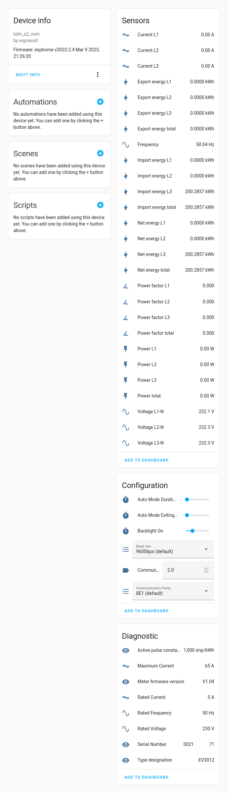

# ESP32 modbus ABB-EV3
Reading the ABB kWh meter with ESP32 over modbus, publising to Home Assistant

## Hardware
- ESP32 board [Wemos S2-mini](https://www.wemos.cc/en/latest/s2/s2_mini.html)
- TTL to RS485 converter [MAX485](https://www.analog.com/en/products/max485.html)
- kWh meter [ABB EV3 012-100](https://new.abb.com/products/2CMA290881R1000/ev3-012-100)

## Software / Documentation
- [Home Assistant](https://www.home-assistant.io/) Home automation software
- [ESPHome](https://esphome.io/) to program the ESP32 (Home Assistant plugin)
- [ABB Modbus documentation](https://search.abb.com/library/Download.aspx?DocumentID=9AKK107991A9529&DocumentPartId=)

ESPHome config file: [abb_ev3.yaml](abb_ev3.yaml)

Screenshot from Home Assistant:

